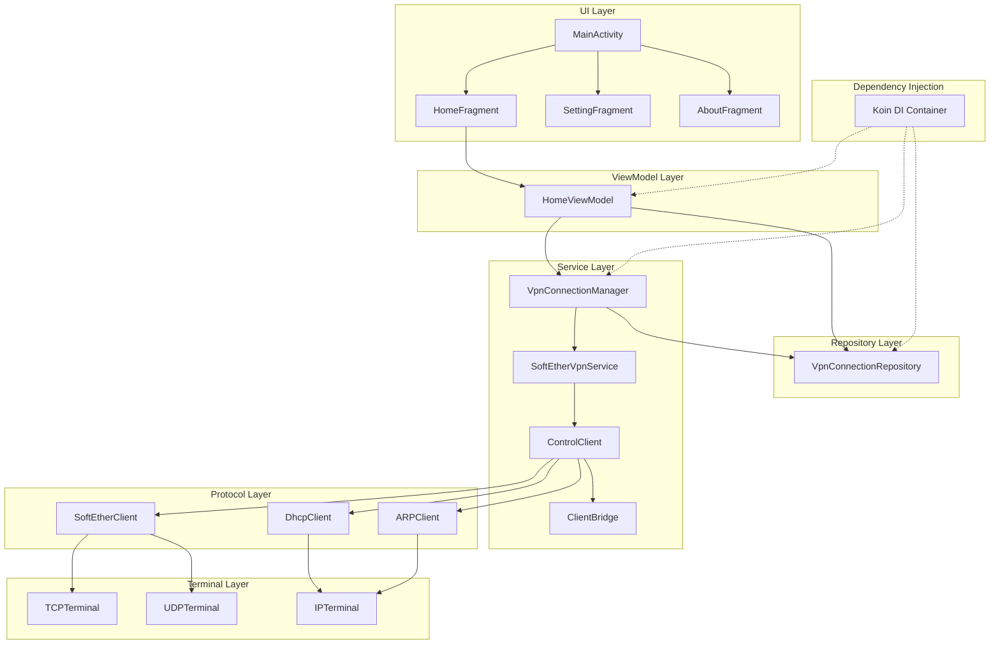
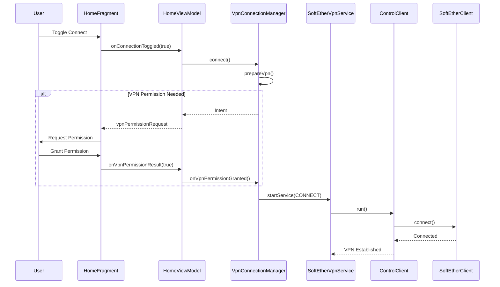
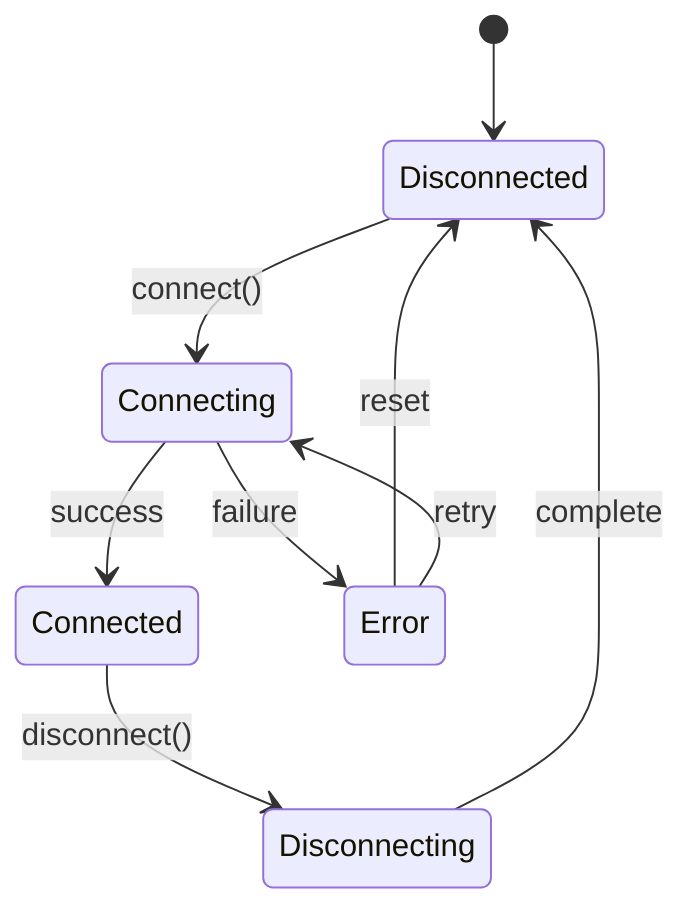

# SoftEther Connect - Architecture Documentation

## Overview

SoftEther Connect is an Android VPN client that implements the SoftEther VPN protocol.
The application follows a layered architecture with clear separation of concerns.

## Architecture Diagram



## Layer Descriptions

### UI Layer

The UI layer consists of Android Fragments that display the user interface:

- **MainActivity**: Main activity hosting the tab layout with ViewPager2
- **HomeFragment**: Home screen with VPN connect/disconnect toggle
- **SettingFragment**: VPN configuration settings
- **AboutFragment**: Application information and credits

### ViewModel Layer

ViewModels manage UI state and handle user interactions:

- **HomeViewModel**: Manages VPN connection state for the home screen
  - Exposes `connectionState` as StateFlow for reactive UI updates
  - Handles connection toggle events
  - Manages VPN permission requests

### Repository Layer

Repositories provide a clean API for data access:

- **VpnConnectionRepository**: Manages VPN connection state
  - Provides `connectionState` as StateFlow
  - Synchronizes state with SharedPreferences
  - Notifies observers of state changes

### Service Layer

Services handle the VPN connection lifecycle:

- **VpnConnectionManager**: Coordinates VPN operations
  - Handles connect/disconnect requests
  - Manages VPN permission flow
  - Bridges UI and VPN service

- **SoftEtherVpnService**: Android VpnService implementation
  - Runs as a foreground service
  - Creates and manages the VPN tunnel
  - Handles service lifecycle

- **ControlClient**: Main VPN connection orchestrator
  - Coordinates protocol clients
  - Manages connection state machine
  - Handles errors and reconnection

- **ClientBridge**: Central state and configuration holder
  - Stores connection parameters
  - Provides shared state between components

### Protocol Layer

Protocol clients implement the SoftEther VPN protocol:

- **SoftEtherClient**: SoftEther protocol implementation
  - Handles authentication
  - Negotiates connection parameters
  - Manages keepalive packets

- **DhcpClient**: DHCP client for IP address assignment
  - Sends DHCP Discover/Request
  - Parses DHCP responses
  - Configures IP address and routes

- **ARPClient**: ARP client for gateway resolution
  - Resolves gateway MAC address
  - Handles ARP requests/responses

### Terminal Layer

Terminals handle low-level network I/O:

- **TCPTerminal**: SSL/TLS socket management
  - Establishes secure connections
  - Handles SSL handshake
  - Manages socket I/O

- **UDPTerminal**: UDP acceleration support
  - Handles UDP NAT traversal
  - Manages UDP socket I/O
  - Provides faster data transfer

- **IPTerminal**: IP packet handling
  - Reads/writes IP packets to VPN interface
  - Handles packet routing

## Data Flow

### Connection Flow



### State Management



## Dependency Injection

The application uses Koin for dependency injection. All dependencies are defined in `AppModule.kt`:

```kotlin
val appModule = module {
    // Repository Layer
    single { VpnConnectionRepository(androidContext()) }

    // Service Layer
    single { VpnConnectionManager(androidContext(), get()) }

    // ViewModel Layer
    viewModel { HomeViewModel(get(), get()) }
}
```

## Interfaces for Testability

The codebase defines interfaces to enable mocking and testing:

- **IVpnConnection**: VPN connection abstraction
- **IProtocolHandler**: Protocol handler abstraction
- **INetworkTerminal**: Network I/O abstraction

These interfaces allow for:

- Unit testing with mock implementations
- Integration testing with fake servers
- Dependency injection flexibility

## Key Design Decisions

1. **StateFlow for Reactive UI**: Connection state is exposed as StateFlow for efficient, lifecycle-aware UI updates.

2. **Repository Pattern**: VpnConnectionRepository provides a single source of truth for connection state.

3. **MVVM Architecture**: ViewModels separate UI logic from Fragments, improving testability.

4. **Koin DI**: Chosen over Hilt for simpler setup without annotation processing.

5. **Coroutines**: Used throughout for asynchronous operations and structured concurrency.

## File Structure

```
app/src/main/java/kittoku/mvc/
├── di/                     # Dependency injection
│   └── AppModule.kt
├── fragment/               # UI Fragments
│   ├── HomeFragment.kt
│   ├── SettingFragment.kt
│   └── AboutFragment.kt
├── preference/             # Preference handling
│   ├── accessor/
│   └── custom/
├── repository/             # Data repositories
│   └── VpnConnectionRepository.kt
├── service/                # VPN service
│   ├── client/             # Protocol clients
│   │   ├── arp/
│   │   ├── dhcp/
│   │   ├── softether/
│   │   └── stateless/
│   ├── contract/           # Interfaces
│   │   ├── INetworkTerminal.kt
│   │   ├── IProtocolHandler.kt
│   │   └── IVpnConnection.kt
│   ├── teminal/            # Network terminals
│   │   ├── ip/
│   │   ├── tcp/
│   │   └── udp/
│   ├── SoftEtherVpnService.kt
│   └── VpnConnectionManager.kt
├── unit/                   # Data units/packets
│   ├── arp/
│   ├── dhcp/
│   ├── ethernet/
│   ├── http/
│   ├── ip/
│   ├── keepalive/
│   ├── property/
│   └── udp/
├── viewmodel/              # ViewModels
│   └── HomeViewModel.kt
├── MainActivity.kt
└── MvcApplication.kt
```
